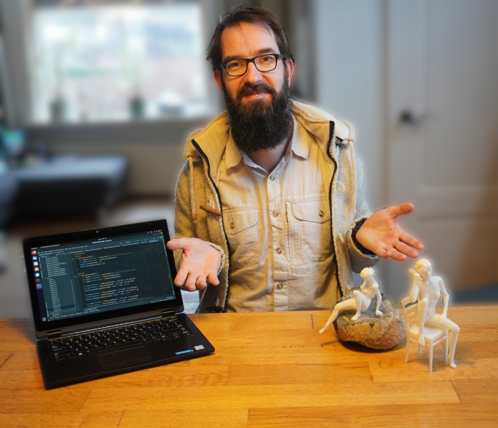

<link type="text/css" rel="stylesheet" href="static/style/style.css">

# Antfield Creations
Antfield maakt software and kunst, in willekeurige volgorde en soms tegelijk.

## Software

Senior freelance remote software engineer in Python/Rust/Geo/Erfgoed.

### Expertise

- Python developer 7jr+, 
  - [Pypi.org published](https://pypi.org/project/deep-geometry), Geo and Machine Learning
    ervaring, lees meer op https://arxiv.org/abs/1806.03857
  - QGIS plugin and test engineer: lees erover
    op [mijn blog](https://reinvantveer.github.io/2021/04/10/qgis-plugin-development.html)
- Open source geo engineer 15jr+
- Kubernetes Argo workflow engineer 2jr+, met verschillende bijdragen aan
  het [Argo Helm](https://github.com/argoproj/argo-helm) project
- "Test advocate" 6jr+
- Rust ontwikkelaar 2jr+, met bijdragen aan 
  - retro-embedded Rust voor de [Rust Sega Megadrive](https://github.com/ricky26/rust-mega-drive) 
  - [Rust Kubernetes Operator prototype](https://github.com/Pscheidl/rust-kubernetes-operator-example/pull/6)

### Voorkeuren
- Open source waar mogelijk
- Toegewijd aan kennisoverdracht: ik ben hier gekomen dankzij diegenen die mij onderwezen hebben!
- Remote of hybride, freelance projecten
